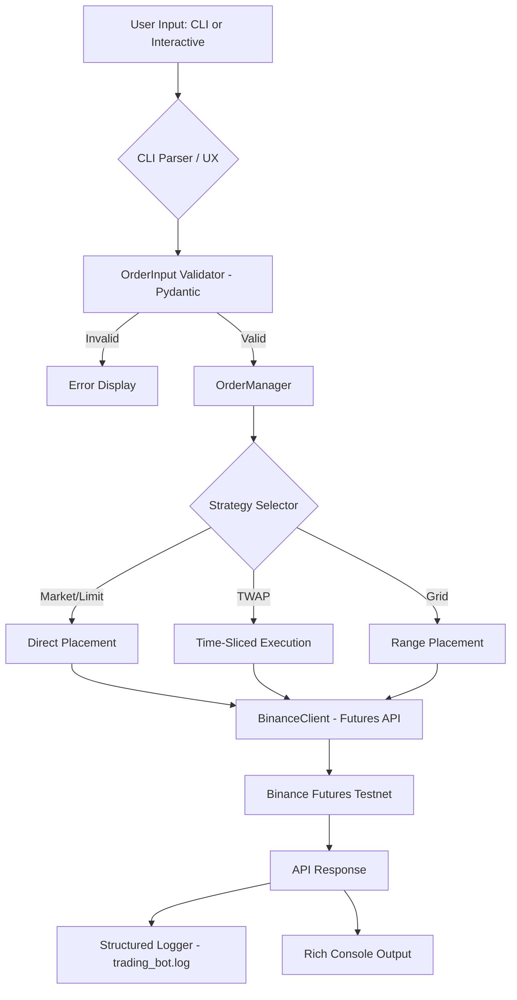

# Binance Futures Testnet Trading Bot

A simplified, robust Python application to place orders on the Binance Futures Testnet (USDT-M).

## Features
- **Place Orders**: Support for MARKET, LIMIT, and TWAP orders.
- **Enhanced CLI UX**: Interactive prompts and beautiful output using `rich` and `typer`.
- **Validation**: Pydantic models for strict input validation.
- **Logging**: Structured logging of all API requests and responses to `trading_bot.log`.
- **Error Handling**: Graceful handling of API errors and invalid inputs.

## Logic Flow & Architecture



## Setup

1. **Clone the repository** (if applicable) or enter the project directory.
2. **Create a virtual environment**:
   ```bash
   python -m venv .venv
   source .venv/bin/activate  # On Windows: .venv\Scripts\activate
   ```
3. **Install dependencies**:
   ```bash
   pip install -r requirements.txt
   ```
4. **Configure API Keys**:
   - Copy `.env.example` to `.env`.
   - Fill in your `BINANCE_API_KEY` and `BINANCE_API_SECRET` from the [Binance Futures Testnet](https://testnet.binancefuture.com).

## Usage

### Interactive Mode
Simply run the script to enter the interactive menu:
```bash
python cli.py
```

### CLI Mode
You can also pass arguments directly:
```bash
python cli.py place --symbol BTCUSDT --side BUY --order-type MARKET --quantity 0.001
```

For LIMIT orders:
```bash
python cli.py place --symbol BTCUSDT --side BUY --order-type LIMIT --quantity 0.001 --price 60000
```

### Advanced: TWAP Order
This bot supports a simple TWAP (Time Weighted Average Price) implementation that splits your total quantity into multiple chunks and places them as market orders over time.
```bash
python cli.py place --symbol BTCUSDT --side BUY --order-type TWAP --quantity 0.01
```

## Help & Auto-completion

The bot uses **Typer**, which provides two levels of help documentation:

- **Global Help**: To see global options (like `--install-completion` for tab-complete), run:
  ```bash
  python cli.py --help
  ```
- **Command Help**: To see all trading flags (like `--symbol`, `--stop-loss`, etc.), run:
  ```bash
  python cli.py place --help
  ```

---

## Screenshots
For a visual gallery of the CLI and Binance Dashboard in action, please see:
👉 **[View Project Screenshots](./images.md)**

---

## Project Structure
- `bot/client.py`: Binance client initialization.
- `bot/orders.py`: Core order placement logic.
- `bot/validators.py`: Input validation schemas.
- `bot/logging_config.py`: Logging setup.
- `cli.py`: Main entry point with Typer.

## Note on Logging
The file `trading_bot.log` is intentionally included in this repository to demonstrate successful order execution on the Binance Futures Testnet. It contains logs for MARKET, LIMIT, and TWAP orders placed during testing.

## Assumptions
- The bot assumes you have a Binance Futures Testnet account.
- The default TWAP interval is 10 seconds with 5 chunks (can be modified in `bot/orders.py`).

## Requirements
- Python 3.x
- `python-binance`
- `typer`
- `rich`
- `pydantic`
- `python-dotenv`
